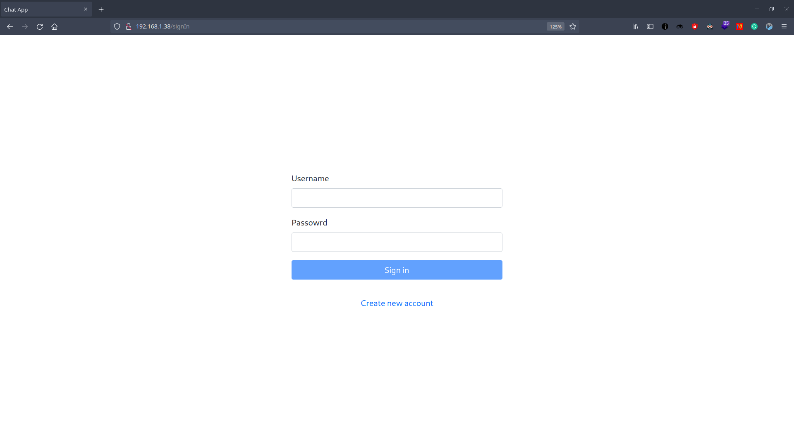
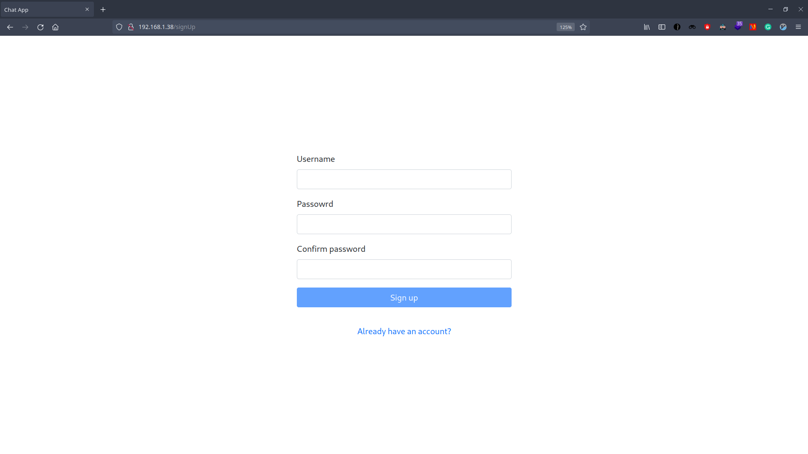
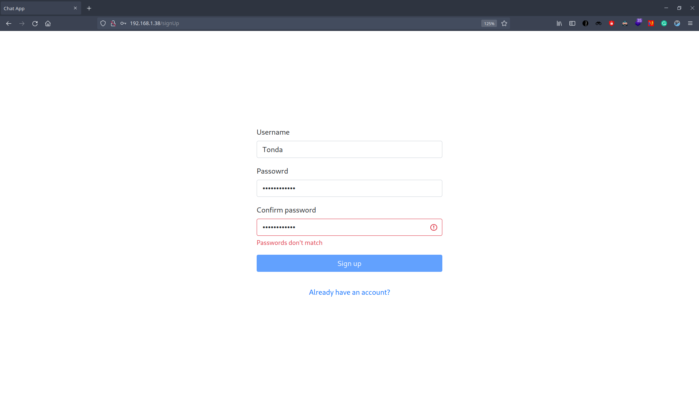
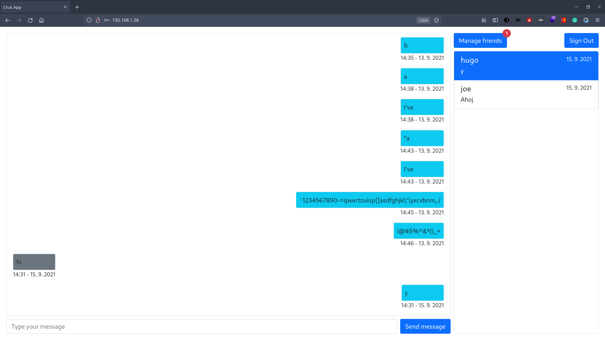
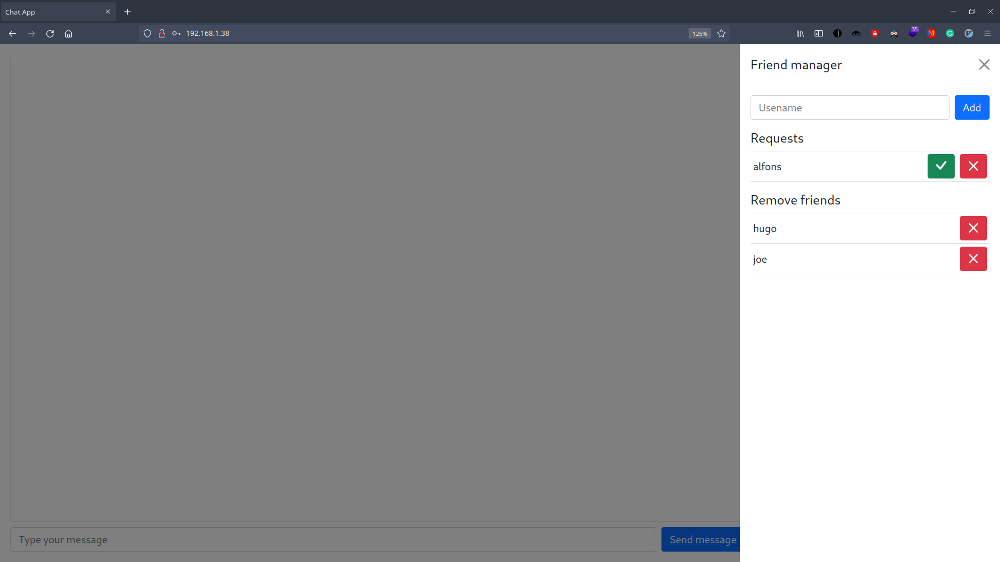

# Zadání aplikace

Webová chatovací aplikace s real-time komunikací skrze websocket.

Požadované funkce aplikace:

- registrace a přihlašování uživatel
- seznam kontaktů
- přidávání do kontaktů
- konverzace mezi kontakty 1 na 1
- ukládání dat do databáze

# Spuštění aplikace

1. Naklonovat repozitář `git clone https://gitlab.mff.cuni.cz/teaching/nprg031/2021-summer/student-josefd.git`
2. Otevřít hlavní složku `cd student-josefd`
3. Vytvořit .env soubor podle .env.example (nastavit vlastní adresu/porty podle potřeby)
4. Spustit příkaz `docker-compose up`
5. Otevřít zvolenou adresu klienta v prohlížeči

**Příklad .env souboru:**

```
# CLIENT
CLIENT_SERVICE_ADDRESS=192.168.1.38
CLIENT_SERVICE_PORT=80

# SERVER
SERVER_SERVICE_ADDRESS=192.168.1.38
SERVER_SERVICE_PORT=8080
```

# Ovládání aplikace

## Obrazovka přihlášení

Po otevření aplikace je každý nepřihlášený uživatel přesměrován na přihlašovací obrazovku. Zde musí zadat své přihlašovací údaje, nebo přejít k vytvoření nového účtu (odkaz `Create new account`), pokud ještě není registrován.

Přihlašovací obrazovka se náchází na podadrese `/signIn` a je přístupna pouze nepřihlášeným uživatelům.


## Obrazovka registrace

Zde si může uživatel vytvořit nový účet zadáním požadovaných údajů, nebo přejít na přihlašovací obrazovku (odkaz `Already have an account?`) pokud si již účet vytvořil.

Obrazovka registrace se náchází na podadrese `/signUp` a je přístupna přihlášeným i nepřihlášeným uživatelům.



Zadané údaje musí splňovat následující podmínky:

- username
  - nejméňe 2 znaky
  - pouze čísla a písmena abecedy
  - nesmí se shodovat s již existujícím uživatelem
- password
  - nejméně 8 znaků
  - pouze čísla a písmena abecedy
- confirm password
  - musí se shodovat s položkou password

V případě zadání nevalidních údajů je uživatel informován chybovým textem pod danou položkou.



## Obrazovka konverzací

Tato sekce se nachází na kořenové adrese a je přístupna pouze přihlášeným uživatelům.


Na pravé straně se nachází seznam kontaktů s poslední zprávou konverzace u každého kontaktu. Aktuálně zvolená konverzace je zobrazena modře a její obsah je vidět v levé části obrazovky. Do aktuálně otevřené konverzace lze napsat novou zprávu pomocí textového pole v dolní čášti obrazovky.

Po stisknutí tlačítka manage friends (v pravé horní části obrazovky) se otevře okno pro přidávání a správu kontaktů.

Zde se nachází dvě sekce. První s žádostmi o přátelství. Zeleným tlačítkem uživatel žádost přijme, červeným odmítne. V druhé části uživatel vidí seznam svých kontaktů a červeným tlačítkem je může odstranit z kontaktů.

# Back-end (server)

## Architektura

Architektura serveru je rozdělena do tří vrstev.

1. Komunikační vrstva (api, websocket)
2. Vrstva služeb (services)
3. Datová vrstva (models)

### 1. Komunikační vrstva

Zařizuje komunikaci s clientem. Rozdělena na api a websockety.

#### Api (api.ts, routes.ts)

Komunikace skrze http endpointy. Tato čášt zajišťuje komunaci během registrace a přihlašování uživatele.

Definovány jsou následující endpointy (routes.ts):

- /signIn - (přihlášení) přijme přihlašovací údaje, pokud jsou validní vrátí http-only cookie s id relace (kód 200). Pokud nejsou vrátí kód 400 a chybu (špatné heslo/jméno)

- /signUp - (registrace) přijme přihlašovací údaje a vytvoří záznam o novém uživateli. vrátí kód 200. Pokud již uživatel s daným jménem existuje vrátí kód 400.

- /verify - (ověření relace) přečte cookie s id relace, pokud je validní vrátí kód 200, jinak 401

- /signOut - (odhlášení) vynuluje relační cookie, odstraní záznam o relaci

#### websockety (websocketServer.ts)

Komunikace skrze websockety. Zajišťuje většinu komunikace po přihlášení uživatele (vyjímkou je odhášení).

Zde je definována třída `websocketServer`, která implementuje websocket protokol a spravuje aktivní websockety.

**Websocket frame protokol:**

```
 0                   1                   2                   3
 0 1 2 3 4 5 6 7 8 9 0 1 2 3 4 5 6 7 8 9 0 1 2 3 4 5 6 7 8 9 0 1
+-+-+-+-+-------+-+-------------+-------------------------------+
|F|R|R|R| opcode|M| Payload len |    Extended payload length    |
|I|S|S|S|  (4)  |A|     (7)     |             (16/64)           |
|N|V|V|V|       |S|             |   (if payload len==126/127)   |
| |1|2|3|       |K|             |                               |
+-+-+-+-+-------+-+-------------+ - - - - - - - - - - - - - - - +
|     Extended payload length continued, if payload len == 127  |
+ - - - - - - - - - - - - - - - +-------------------------------+
|                               |Masking-key, if MASK set to 1  |
+-------------------------------+-------------------------------+
| Masking-key (continued)       |          Payload Data         |
+-------------------------------- - - - - - - - - - - - - - - - +
:                     Payload Data continued ...                :
+ - - - - - - - - - - - - - - - - - - - - - - - - - - - - - - - +
|                     Payload Data continued ...                |
+---------------------------------------------------------------+
```

- první byte
  - první bit říká zda je frame finální
  - další tři jsou rezervované (bez významu)
  - poslední čtyři jsou opcode (určují typ framu)
- druhý byte
  - první bit určuje zda je payload maskována
  - zbylých sedm délku paylaod
    - pokud se délka rovná 126 následující dva byty obshaují skutečnou délku
    - pokud se délka rovná 127 následujících osm bytů obshauje skutečnou délku
- pokud je payload maskována následují čtyřy byty jsou maskovací klíč
- zbytek bytů je payload

**Payload:**

V rámci této aplikace je payload vždy Json v následujícím tvaru:

```
SocketComm {
  type - typ zprávy
  to - komu má být zpráva doručena
  from - kdo zprávu poslal
  pingBack - zda má být zpráva záslána i spět na zařízení odesílatele
  friendship - id přátelství mezi uživateli
  content - obsah
  friendlist - list uživatel kteří jsou přáteli
  friendRequests - list uživatel kteří chtějí být přáteli
  replies - list zpráv mezi uživateli
  refreshFriendlist - zda je potřeba aby si uživatel znovu načetl seznam přátel (přidání nového přítele)
}
```

V rámci jedné websocket zprávy nemusí být vyplněny všechny položky.

Seznam typů:

1. friendRequest - nová žádost o přátelství
2. acceptFriend - přijetí žádosti o přátelství
3. refuseFriend - odmítnutí žádosti o přátelství
4. removeFriend - odstranění z přátel
5. refreshFriendlist - obnovení seznamu přátel
6. message - nová zpráva
7. loadReplies - načtení starších zpráv konverzace
8. init - posíláno na každé nové websocket spojení
   - obsahuje list přátel, žádostí o přátelství, poslední zprávu od každého kontaktu

### 2. Vrstva služeb (services)

V této vrstvě jsou 4 služby ve který probíhá zpracování dat.

1. `comm.service.ts` - zpracování dat z websocketů
2. `friendship.service.ts` - vytváření nových žádostí o přátelství a kontaků
3. `user.service.ts` - vytváření a validace uživatel
4. `session.service.ts` - vytváření, validace, odstraňení uživatelských relací

### 3. Datová vrstva (models)

Tato vrstva komunikuje s MySql databází. Probíhá zde ukládání a vyhledávání dat. Připojení na databázi je zařízeno mysql node balíčkem.

Spojení s databází je nastaveno v `db.ts`.

**Schéma databáze:**

1. friendrequests
   - request_id
   - from_user
   - to_user
2. friendships
   - friendship_id
   - first_user_id
   - second_user-id
3. replies
   - reply_id
   - friendship_id
   - sender_id
   - text
   - date
4. sessions
   - session_id
   - user_id
5. users
   - user_id
   - username
   - salt
   - password

Pro každou tabulku v databázi je definována třída s komunikačními metodami (obal pro SQL příkaz).

## Struktura adresářů

```
server
│
└───src
    │   index.ts - vstupní bod serveru (inicializace api a websocketServer)
    │
    └───api
    │   │   api.ts - vstupní bod api, nastavení http headrů
    │   │   routes.ts - jednotlivé api endpointy
    │
    └───models - třídy pro komunikaci s databází
    │   │   db.ts - inicializace připojení k databázi
    │   │   friendrequests.model.ts
    │   │   friendships.model.ts
    │   │   replies.model.ts
    │   │   sessions.model.ts
    │   │   user.model.ts
    │
    └───services
    │   │   comm.service.ts - logika komunikace skrze websockety
    │   │   friendship.service.ts -  přidávání přátel
    │   │   session.service.ts - logika uživatelských relací
    │   │   user.service.ts - logika vytváření a ověřování uživatel
    │
    └───utils
    │   │   error.ts - třída pro vytváření chybových objektů
    │   │   parsers.ts - několik funkcí pro parsování dat
    │   │   types.ts - definice typů
    │
    └───websocket
        │   websocketServer.ts - implementace websocket protokolu

```

# Front-end (client)

## Architektura

Přihlašovací a registrační stránky jsou samostatné a komunikují se serverem skrze http requesty. Zbytek aplikace je sestaven z jednotlivých komponent v `HomePage.tsx`. Zde je uložen aktuální stav a načtená data v proměné `state`. Zároveň jsou tak zde definovány veškeré metody pro komunikaci se serverem srze websocket. Metody a data jsou potom předávány do jednotlivých komponent pomocí `props`.

## Struktura adresářů

```
client
│
└───src
    │   index.tsx - vstupní bod klienta
    │   App.tsx - základní komponent
    │   index.css - css (na většinu stylování aplikace je použit bootstrap)
    │
    └───components
    │   │   ChatInput.tsx - input bar pro zadávání zpráv
    │   │   ChatWindow.tsx - okno pro zobrazení zpráv
    │   │   Friendlist.tsx - seznam kontaktů
    │   │   FriendManager.tsx - manager pro přidávání a odebírání kontaktů
    │   │   SignOutButton.tsx - button pro odhlášení
    │   │
    │   └───routeGuards
    │       │ anonymousRoute.tsx - obal pro cesty určené pouze nepřihlášeným
    │       │ privateRoute.tsx - obal pro cesty určené pouze přihlášeným
    │
    └───pages
    │   │   HomePage.tsx - hlavní stránka
    │   │   SignInPage.tsx - přihlašovací stránka
    │   │   SignUpPage.tsx - stránka registrace
    │
    └───utils
        │   constants.ts - constanty zdílené mezi komponenty
        │   validator.ts - validátor pro fromuláře
```
